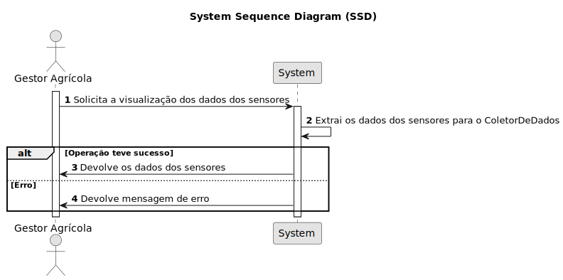

# USAC06 - Alterar a função "extract_token" para retornar 1 ou 0

## 1. Requirements Engineering

### 1.1. User Story Description

Como Gestor Agrícola, quero que seja possível determinar se a extração da informação do sensor teve sucesso ou não.

### 1.2. Customer Specifications and Clarifications 

**From the specifications document:**

> USAC06 – Altere a função:
void extract_token(char* input, char* token,int* output)
desenvolvida na USAC01 para:
int extract_token(char* input, char* token, int* output)
que retorna 1 em caso de conseguir extrair a informação do token e 0 em caso contrário.

**From the client clarifications:**

> **Question:**  
>  
> **Answer:** 

### 1.3. Acceptance Criteria

* **AC1:** Esta função deve ser implementada em Assembly.

### 1.4. Found out Dependencies

* Há uma dependência com a USAC01.

### 1.5 Input and Output Data

**Input Data:**

* Endereço de memória do input
* Endereço de memória do token
* Endereço de memório do output

**Output Data:**

* 0 ou 1

### 1.6. System Sequence Diagram (SSD)

### 1.7 Other Relevant Remarks

*  N/A.