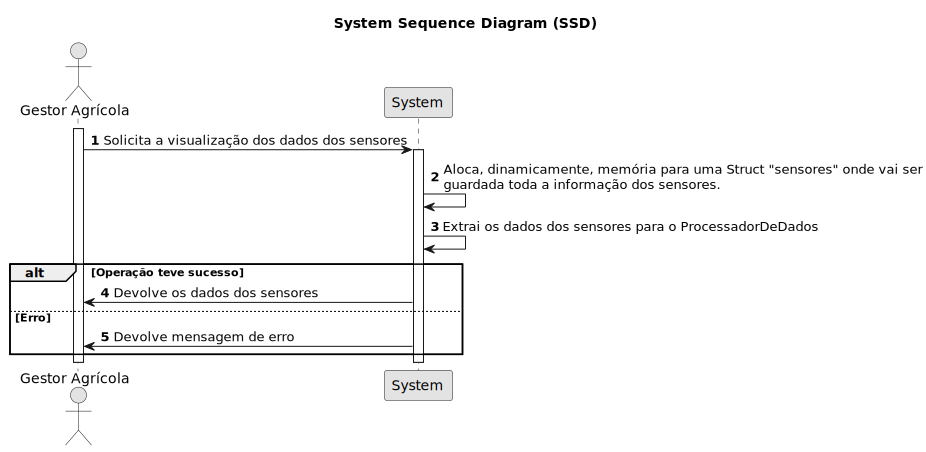

# USAC07 - Alocar dinamicamente as estruturas de dados utilizadas no ProcessadorDeDados

## 1. Requirements Engineering

### 1.1. User Story Description

Como Gestor Agrícola, quero que a utilização de memória seja otimizada na recolha de dados dos sensores.

### 1.2. Customer Specifications and Clarifications 

**From the specifications document:**

> USAC07 - Desenvolva uma função que aloque dinamicamente as estruturas de dados necessários para o componente e configure o componente.

**From the client clarifications:**

> **Question:**  
>  
> **Answer:** 

### 1.3. Acceptance Criteria

### 1.4. Found out Dependencies

* Há uma dependência com a USAC08 onde são extraídos os dados com base na configuração da USAC07.

### 1.5 Input and Output Data

**Input Data:**

**Output Data:**

### 1.6. System Sequence Diagram (SSD)

### 1.7 Other Relevant Remarks

*  N/A.