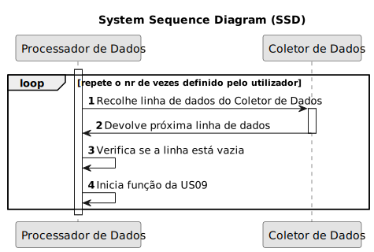

# USAC08 - Função que receba os dados enviados pelo componente ColetorDeDados

## 1. Requirements Engineering
### 1.1. User Story Description
_"Como Gestor Agrícola, pretendo que o sistema descodifique os dados do sensor, para executar cálculos."_

### 1.2. Customer Specifications and Clarifications 

**From the specifications document:**
> N/A

**From the client clarifications:**

> **Q:** N/A
>  
> **A:** N/A

### 1.3. Acceptance Criteria

* **AC1:** Deverá ser possível receber dados de vários tipos de sensores.
* **AC2:** Deverá ser possível receber dados de um número variável de sensores.

### 1.4. Found out Dependencies

* Depende das estruturas desenvolvidas na USAC07.
* Depende das funcionalidades assembly desenvolvidas no Sprint 2.

### 1.5 Input and Output Data

**Input Data:**
* N/A

**Output Data:**
* Retorna 0 se executado com sucesso e um qualquer outro número em caso de insucesso.

### 1.6. System Sequence Diagram (SSD)

### 1.7 Other Relevant Remarks

*  N/A.