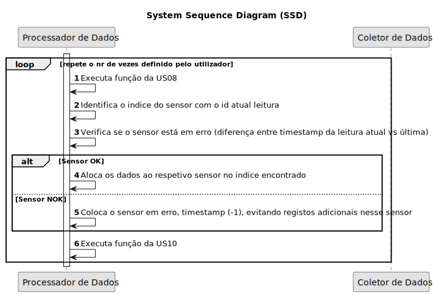

# USAC09 - Função que insira os dados recebidos do componente ColetorDeDados nas estruturas de dados

## 1. Requirements Engineering
### 1.1. User Story Description
_"Como Gestor Agrícola, pretendo que o sistema guarde, em memória, os dados do sensor recolhidos, para executar cálculos."_

### 1.2. Customer Specifications and Clarifications 

**From the specifications document:**
> N/A

**From the client clarifications:**

> **Q:** N/A
>  
> **A:** N/A

### 1.3. Acceptance Criteria

* **AC1:** Deverá ser possível receber dados de vários tipos de sensores.
* **AC2:** Deverá ser possível receber dados de um número variável de sensores.
* **AC3:** Apenas deverá aceitar valores de sensores existentes.
* **AC4:** Deverá verificar se o sensor está em erro e registar de acordo.

### 1.4. Found out Dependencies

* Depende das estruturas desenvolvidas na USAC07.
* Depende das funcionalidades assembly desenvolvidas no Sprint 2.
* Depende da funcionalidade desenvolvida na USAC08.

### 1.5 Input and Output Data

**Input Data:**
* N/A

**Output Data:**
* Retorna 0 se executado com sucesso e um qualquer outro número em caso de insucesso.
* Coloca timestamp a (-1) indicando sensor em erro, em caso de erro.

### 1.6. System Sequence Diagram (SSD)

### 1.7 Other Relevant Remarks

*  N/A.