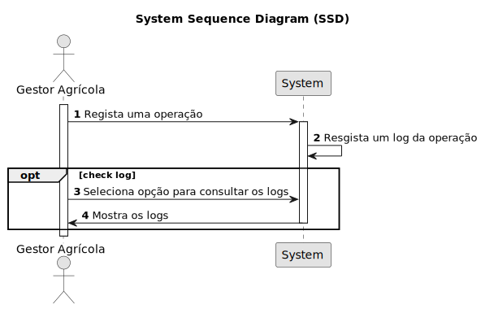

# USBD24 e 26 - Registar logs de atualização/registo de operações

## 1. Requirements Engineering

### 1.1. User Story Description

Como Gestor Agrícula, quero registar logs de atualização/registo de operações, para que possa ter um histórico de operações realizadas.

### 1.2. Customer Specifications and Clarifications 

**From the specifications document:**

> USBD24 Como Gestor Agrícola, pretendo que todos os registos relacionados com operações tenham registado o instante em que foram criados, gerado pelo SGBD.
> 
> USBD26 Como Gestor Agrícola, pretendo que a criação ou alteração de um registo de uma operação deva ser registado num log que indique o instante, tipo de operação e todos os dados relacionados com a operação (e.g. data da operação, parcela, etc.).

**From the client clarifications:**

> **Question:**  
>  
> **Answer:** 

### 1.3. Acceptance Criteria

* **AC1:** 
* **AC2:** 

### 1.4. Found out Dependencies

* Há uma dependência entre a USBD24 e 26 visto que ao criar um log, já estamos a registar o instante em que foi criado o registo da operação.

### 1.5 Input and Output Data

**Input Data:**

* Nenhum.

**Output Data:**

* Log de operação.

### 1.6. System Sequence Diagram (SSD)

### 1.7 Other Relevant Remarks

*  N/A.