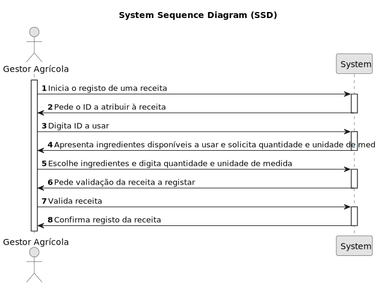

# USBD31 - Registar uma receita de fertirrega para usar em operações de rega

## 1. Requirements Engineering
### 1.1. User Story Description
_"Como Gestor Agrícola, pretendo registar uma receita de fertirrega para usar em operações de rega."_

### 1.2. Customer Specifications and Clarifications 

**From the specifications document:**
> N/A

**From the client clarifications:**

> **Q:** N/A
>  
> **A:** N/A

### 1.3. Acceptance Criteria

* **AC1:** O ingrediente deverá conter a quantidade por hectar a usar.
* **AC2:** A receita deve conter as informações necessárias ao uso da operação FERTIRREGA.

### 1.4. Found out Dependencies

* Depende da existência de Fatores de Produção, para que possam ser listados, e escolhidos de acordo com a intenção do utilizador.

### 1.5 Input and Output Data

**Input Data:**
* ID da Receita (digita);
* Fator Produção (escolhe da lista);
* Quantidade por hectar (digita);
* Unidade de medida (digita).

**Output Data:**
* Mensagem de validação do registo.

### 1.6. System Sequence Diagram (SSD)

### 1.7 Other Relevant Remarks

*  N/A.