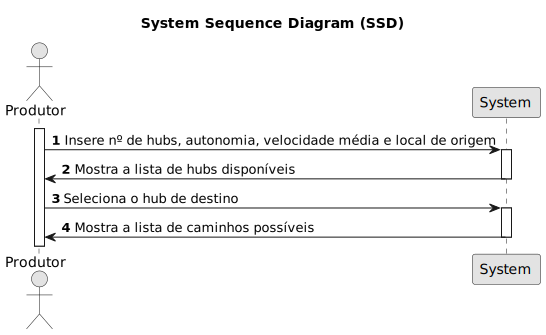

# USEI06 - Calcular os caminhos possíveis entre um local e um hub na rede de distribuição

## 1. Requirements Engineering

### 1.1. User Story Description

Como Produtor, quero saber os caminhos possíveis entre um local e um hub na rede de distribuição, para que possa escolher o caminho mais rápido para a entrega de produtos.

### 1.2. Customer Specifications and Clarifications 

**From the specifications document:**

> USEI06 – Encontrar para um produtor os diferentes percursos que consegue fazer entre um local de origem e um hub limitados pelos Kms de autonomia do seu veículo elétrico, ou seja, não considerando carregamentos no percurso.

**From the client clarifications:**

> **Question:**  
>  
> **Answer:** 

### 1.3. Acceptance Criteria

* **AC1:** Devolver para cada percurso o local de origem, os locais de passagem (sendo um hub, identificá-lo), distância entre todos os locais do percurso, distância total e tempo total de percurso.

### 1.4. Found out Dependencies

* Há uma dependência com a USEI02 onde são definidos os locais dos hubs segundo um critério.

### 1.5 Input and Output Data

**Input Data:**

* Local de origem.
* Quantidade de hubs
* Hub de destino
* Autonomia do veículo elétrico.
* Velocidade média do veículo elétrico.

**Output Data:**

* Listagem de todos os percursos possíveis entre o local de origem e o hub de destino, com a distância total e o tempo total de percurso.

### 1.6. System Sequence Diagram (SSD)

### 1.7 Other Relevant Remarks

*  N/A.